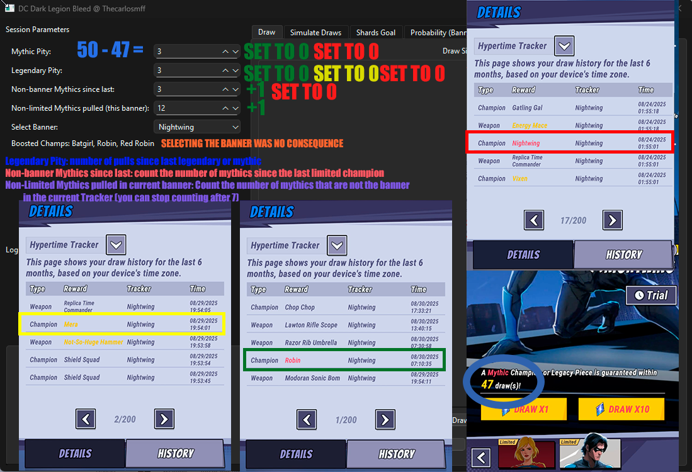

# DC-Dark-Legion-Helper
Currently a bleed simulator for DC Dark Legion.

## [Download](https://github.com/Thecarlosmff/DC-Dark-Legion-Helper/releases) 

 
 
## Setup (For devs)

1. **Windows**  
   - Double-click `setup_env_windows.bat`  
   - Wait until it finishes installing Python + dependencies  
   - Run:  
     ```
     venv\Scripts\activate.bat
     python main.py
     ```

2. **Linux / macOS**  
   - Run in terminal:  
     ```bash
     chmod +x setup_env_mac-linux.sh
     ./setup_env.sh
     source venv/bin/activate
     python main.py
     ```

### Notes
- First run will set everything up.  
- Next time, just activate the environment and run the app.  
- If Python was already installed, it won’t reinstall.  


## How to create an executable file

   ```bash
   pip install PyInstaller
   pyinstaller main.py -F --noconsole --onefile --add-data "icon.png;."
   # in mac:
      # pyinstaller main.py -F --noconsole --onefile --add-data "icon.png:."
   ```


# 🔧 How to Set Up This Project Locally (VS Code + GitHub)

Follow the steps below to clone and run the **DC-Dark-Legion-Helper** repository locally using VS Code and Git.

---

## ✅ Prerequisites

- **Git** installed → [Download Git](https://git-scm.com/downloads)  
- **Visual Studio Code** installed → [Download VS Code](https://code.visualstudio.com)  
- A **GitHub account** and access to this repo  

---

## 📥 1. Clone the Repository

1. Open **VS Code**  
2. Press `Ctrl+Shift+P` (or `Cmd+Shift+P` on Mac)  
3. Type `Git: Clone` and select it  
4. Paste the repository URL:
    ```bash
   https://github.com/Thecarlosmff/DC-Dark-Legion-Helper.git
   ```
5. Choose a local folder to save the project  
6. VS Code will open the repo automatically after cloning  

---

## 🧪 2. Verify Git Installation

Open the terminal in VS Code and run:

```bash
git --version
```

If you don’t have Git installed, download it from [git-scm.com](https://git-scm.com/downloads)

## 🔗 3. Connect VS Code to GitHub

Make sure you're signed into GitHub in VS Code:
   Click the Accounts icon (bottom-left in VS Code)
   Sign in with GitHub if you haven’t already
   VS Code will handle authentication automatically when you push changes

## 🛠️ 4. Development Workflow

Use these commands in the VS Code terminal to track and push changes:
```bash
# Check status of changes
git status

# Stage all changed files
git add .

# Commit with a message
git commit -m "Your commit message"

# Push changes to GitHub
git push origin main
      #If your branch is called master instead of main, replace main with master in the command above.
```

## 🔄 5. Pull Updates from GitHub

Before you start working, always pull the latest code:
```bash
git pull origin main
```
